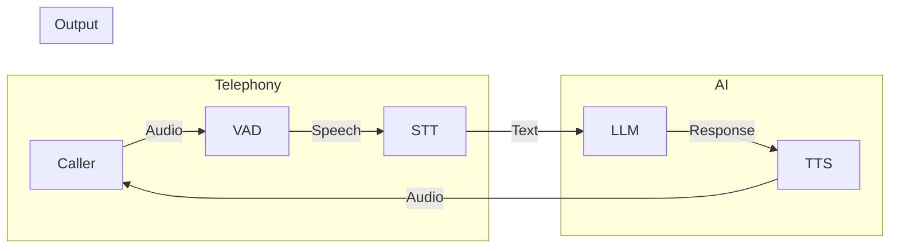

# 04 — Runtime Architecture

## Overview

The Runtime is the **real-time voice conversation engine** at the heart of VoiceGateway. It orchestrates the full duplex voice pipeline:

- Receives streaming audio from a telephony provider (or browser)
- Detects speech boundaries (VAD)
- Transcribes speech to text (STT)
- Generates AI responses (LLM)
- Synthesizes audio from text (TTS)
- Streams audio back to the caller

**Critical design constraint:** The Runtime must remain provider-agnostic. All AI/telephony providers are behind abstract interfaces (ports). No Runtime code imports a concrete provider.

## Architecture

```
                  ┌─────────────────────────┐
                  │   Telephony Provider     │
                  │  (Twilio / SIP / LiveKit)│
                  └───────────┬─────────────┘
                              │ Audio Frames
                              ▼
┌─────────────────────────────────────────────────────────┐
│                       Runtime                             │
│                                                           │
│  ┌──────────┐  ┌──────────┐  ┌──────────┐  ┌──────────┐ │
│  │   VAD    │  │   STT    │  │   LLM    │  │   TTS    │ │
│  │ Adapter  │  │ Adapter  │  │ Adapter  │  │ Adapter  │ │
│  │ (Silero) │  │ (Whisper)│  │ (Ollama) │  │ (Kokoro) │ │
│  └────┬─────┘  └────┬─────┘  └────┬─────┘  └────┬─────┘ │
│       │              │              │              │      │
│       ▼              ▼              ▼              ▼      │
│  ┌─────────────────────────────────────────────────────┐ │
│  │              Port Layer (Abstract Contracts)         │ │
│  │  IVoiceActivityDetector, IAudioTranscriber,         │ │
│  │  ILLMGenerator, IAudioSynthesizer, IWorkflowEngine  │ │
│  └─────────────────────────────────────────────────────┘ │
│                           │                               │
│                           ▼                               │
│  ┌─────────────────────────────────────────────────────┐ │
│  │              Orchestrator (The Brain)                │ │
│  │  - Runs turn loop (listen → think → speak)          │ │
│  │  - Manages conversation state                       │ │
│  │  - Handles barge-in interruptions                   │ │
│  └─────────────────────────────────────────────────────┘ │
│                           │                               │
│                           ▼                               │
│  ┌─────────────────────────────────────────────────────┐ │
│  │           Session Manager                            │ │
│  │  - Manages WebSocket connections                     │ │
│  │  - Tracks active calls                               │ │
│  │  - Routes events                                     │ │
│  └─────────────────────────────────────────────────────┘ │
└─────────────────────────────────────────────────────────┘
```

## Session

A **Session** represents a single end-to-end conversation. It is created when a call connects and destroyed when the call ends.

**Session lifecycle:**

```
Incoming Call → Session Created → Audio Streaming Begins
    ↓
Orchestrator Loop (VAD → STT → LLM → TTS → Playback)
    ↓ (barge-in)
Orchestrator Interrupted → User speaks → Loop restarts
    ↓
Call Ended → Session Destroyed → Transcript Saved
```

**Session holds:**
- Unique session ID
- Call reference (telephony provider call SID)
- Conversation context (message history)
- Configuration (agent ID, language, voice)
- Timestamps (start, end, duration)

## Conversation

A **Conversation** is the ordered sequence of turns within a session.

**Turn structure:**
```
{
  role: "user" | "assistant" | "system",
  content: string | AudioFrame[],
  timestamp: datetime,
  metadata: { confidence, language, duration, interruption? }
}
```

The conversation context is fed to the LLM on each turn to maintain coherent dialogue.

## Orchestrator

The **Orchestrator** is the central coordinator of the voice pipeline. It implements the turn loop:

```
1. Wait for user speech (VAD → SPEAKING state)
2. Wait for silence (VAD → SILENCE state)
3. Send accumulated audio to STT
4. Receive transcript
5. Append user turn to conversation context
6. Call LLM with context → stream tokens
7. Feed tokens to TTS → stream audio frames
8. Send audio frames to telephony provider
9. While streaming, monitor VAD (barge-in detection)
10. If barge-in detected → stop TTS → goto 1
11. If stream complete → goto 1
```

**Future orchestrators:**
- `LangGraphOrchestrator` — multi-step reasoning, tool calls, conditional branching
- `SimpleOrchestrator` — straight STT→LLM→TTS loop (Phase 1)

## Events

The Runtime emits events for external consumption:

| Event | Trigger | Payload |
|---|---|---|
| `session.created` | Call connects | session_id, call_sid, agent_id |
| `session.ended` | Call disconnects | session_id, duration, transcript_ref |
| `turn.user` | User finishes speaking | session_id, text, confidence |
| `turn.assistant` | AI finishes speaking | session_id, text |
| `interruption` | User barges in | session_id, partial_ai_text |
| `error` | Pipeline failure | session_id, error_code, message |

These events propagate through Redis pub/sub and can be consumed by:
- WebSocket (to frontend)
- Call recording service
- Analytics pipeline

## Ports (Abstract Contracts)

Defined in `app/runtime/ports.py`:

### ILLMGenerator

```python
class ILLMGenerator(ABC):
    @abstractmethod
    async def generate_response_stream(self, context: RuntimeContext) -> AsyncGenerator[str, None]:
        """Stream AI response tokens from conversation context."""
```

### IAudioTranscriber

```python
class IAudioTranscriber(ABC):
    @abstractmethod
    async def start_stream(self) -> None
    @abstractmethod
    async def process_audio(self, audio_frame: AudioFrame) -> TranscriptionResult
    @abstractmethod
    async def close_stream(self) -> None
```

### IAudioSynthesizer

```python
class IAudioSynthesizer(ABC):
    @abstractmethod
    async def generate_audio_stream(self, text: str) -> AsyncGenerator[AudioFrame, None]
```

### IVoiceActivityDetector

```python
class IVoiceActivityDetector(ABC):
    @abstractmethod
    async def process_audio(self, audio_frame: AudioFrame) -> str
    """Returns SPEAKING or SILENCE."""
```

### IWorkflowEngine

```python
class IWorkflowEngine(ABC):
    @abstractmethod
    async def execute_tool(self, tool_name: str, tool_args: Dict[str, Any], context: RuntimeContext) -> str
```

## Adapters (Provider Implementations)

Adapters live in `app/infrastructure/` and implement the port interfaces:

| Port | Current Adapter | Future Adapters |
|---|---|---|
| `ILLMGenerator` | Ollama (Qwen 2.5 3B) | OpenAI, Anthropic, Gemini |
| `IAudioTranscriber` | Whisper (local) | Deepgram, Azure Speech |
| `IAudioSynthesizer` | Kokoro (local) | ElevenLabs, Azure TTS, PlayHT |
| `IVoiceActivityDetector` | Silero VAD (local) | — |
| `IWorkflowEngine` | (planned) | LangGraph |

**Adapter rule:** Adapters translate between the port interface and the provider's SDK. They handle provider-specific configuration, authentication, error mapping, and lifecycle management.

## Voice Pipeline

The raw voice pipeline data flow:



## Provider Abstraction

The Runtime references providers ONLY through their port interfaces:

```python
# Runtime code — NEVER imports Whisper, Ollama, etc.
class Orchestrator:
    def __init__(self, stt: IAudioTranscriber, llm: ILLMGenerator, tts: IAudioSynthesizer, vad: IVoiceActivityDetector):
        self._stt = stt
        self._llm = llm
        self._tts = tts
        self._vad = vad
```

Concrete providers are injected at startup via the DI system (or a factory). This makes testing trivial — mock ports, test Runtime logic.

## Telephony Abstraction

Telephony providers follow the same pattern:

- **Port:** `ITelephonyProvider` (abstract) — methods for accepting calls, streaming audio, detecting DTMF
- **Adapters:** Twilio (current target), SIP (future), LiveKit (future), Browser Audio (future)

## Dependency Direction

```
Runtime (orchestrator, session, context)
    │  depends only on
    ▼
Ports (abstract interfaces in runtime/ports.py)
    ▲
    │  implemented by
Adapters (in infrastructure/ — WhisperAdapter, OllamaAdapter, etc.)
```

**Rules:**
- Runtime → Ports only (never adapters)
- Adapters → Ports (implement) + Core (shared utilities)
- Adapters → Domain (never — adapters are infrastructure)
- Runtime → Domain (never — runtime is its own concern)

This ensures:
- Providers can be swapped without Runtime changes
- Testing can mock any provider
- Adding a new provider means writing one adapter file

## Provider Configuration

Providers are configured via `core.config.Settings`:

```python
STT_MODEL_SIZE: str = "base"
LLM_MODEL_NAME: str = "qwen2.5:3b"
OLLAMA_BASE_URL: str = "http://localhost:11434"
TTS_MODEL: str = "kokoro-v1.0.onnx"
TTS_DEFAULT_VOICE: str = "af_heart"
VAD_THRESHOLD: float = 0.5
```

## Future Voice Providers

### Browser Voice (Phase 6)

- WebRTC-based audio capture from browser
- No telephony provider needed
- Uses same port interfaces → same Runtime

### SIP (Phase 7+)

- Standard SIP trunk integration
- Maps SIP audio to AudioFrame stream
- Uses same Runtime

### LiveKit (Phase 8+)

- WebRTC SFU for multi-party calls
- Replaces raw telephony provider
- Uses same Runtime
